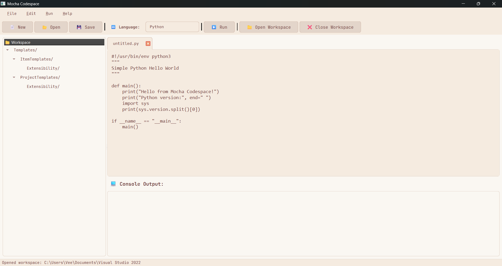

# ☕ Mocha Codespace

A cozy, beginner-friendly IDE with a warm mocha aesthetic. Built with PyQt6/PySide6 and designed for developers who want a pleasant coding environment without overwhelming complexity.


## ✨ Features

### 🎨 Beautiful Mocha Theme
- Warm, pastel color palette inspired by café aesthetics
- Easy on the eyes for long coding sessions
- JetBrains Mono font for optimal code readability
- Smooth, rounded UI elements

### 🔤 Multi-Language Support
Mocha Codespace supports **12+ programming languages** out of the box:

| Language | File Extension | Execution Method |
|----------|----------------|------------------|
| 🐍 Python | `.py` | Interpreted with Python |
| ☕ Java | `.java` | Compiled with `javac`, run with `java` |
| ⚙️ C | `.c` | Compiled with `gcc` |
| ⚙️ C++ | `.cpp` | Compiled with `g++` |
| 📜 JavaScript | `.js` | Run with Node.js or browser |
| 📘 TypeScript | `.ts` | Compiled with `tsc`, run with Node.js |
| 🦀 Rust | `.rs` | Compiled with `rustc` |
| 🐹 Go | `.go` | Run with `go run` |
| 💜 C# | `.cs` | Run with `dotnet` |
| 💎 Ruby | `.rb` | Interpreted with Ruby |
| 🎨 Kotlin | `.kt` | Compiled with `kotlinc`, run with `java` |
| 🌐 HTML/CSS | `.html`, `.css` | Opened in default browser |
| 🌙 Lua | `.lua` | Interpreted with Lua |
| ❄️ Nix | `.nix` | Run with `nix-shell` |

### 📝 Editor Features
- **Auto-indentation**: Smart indenting based on code structure
- **Tab-to-spaces**: Inserts 4 spaces when you press Tab
- **Undo/Redo**: Full edit history support
- **Find text**: Quick search functionality
- **Line numbers**: Visual feedback with line numbering
- **Smart code completion**: Context-aware indentation for blocks

### 🗂️ Workspace Management
- **File tree navigation**: Browse and open files from a workspace folder
- **Tab management**: Multiple files open simultaneously
- **Quick file switching**: Easy navigation between open files
- **Auto-save prompts**: Never lose your work

### ▶️ Code Execution
- **One-click run**: Execute code directly from the IDE
- **Compilation handling**: Automatic compilation for compiled languages
- **Console output**: See program output and errors in real-time
- **Error reporting**: Clear compilation and runtime error messages
- **Threaded execution**: Run code without freezing the UI

### 📁 File Operations
- Create new files with language templates
- Open existing files
- Save and Save As functionality
- Automatic file extension handling
- Smart file type detection

## 🚀 Getting Started

### Prerequisites

**Required:**
- Python 3.8 or higher
- One of: PyQt6 or PySide6

**Optional (but recommended):**
- Pygments (for enhanced syntax highlighting)

**Language-specific requirements** (install only what you need):
- Java: JDK 8+ (with `javac` and `java` in PATH)
- C/C++: GCC or Clang
- Rust: Rust toolchain (`rustc`)
- Go: Go compiler
- TypeScript: Node.js + TypeScript (`npm install -g typescript`)
- C#: .NET SDK
- Ruby: Ruby interpreter
- Kotlin: Kotlin compiler
- Lua: Lua interpreter
- Nix: Nix package manager

### Installation Using Git

#### Interpreting From Source

1. **Clone the repository**
```bash
git clone https://github.com/vanilla-deve/MochaCodespace.git
cd MochaCodespace
```

2. **Install dependencies**

Choose either PyQt6 or PySide6:

```bash
# Option A: PyQt6 (recommended)
pip install PyQt6 pygments

# Option B: PySide6
pip install PySide6 pygments
```

3. **Run the application**
```bash
python main.py
```

#### 📦 Creating a Standalone Executable

You can compile Mocha Codespace into a standalone executable using PyInstaller:

#### Windows
```bash
# Install PyInstaller
pip install pyinstaller

# Create executable
pyinstaller --onefile --windowed --name "MochaCodespace" \
    --icon=icon.ico \
    --add-data "README.md:." \
    main.py

# Executable will be in dist/MochaCodespace.exe
```

#### macOS
```bash
pip install pyinstaller

pyinstaller --onefile --windowed --name "MochaCodespace" \
    --icon=icon.icns \
    --add-data "README.md:." \
    main.py

# App bundle will be in dist/MochaCodespace.app
```

#### Linux
```bash
pip install pyinstaller

pyinstaller --onefile --name "mocha-codespace" \
    --add-data "README.md:." \
    main.py

# Executable will be in dist/mocha-codespace
```

### 🐳 Docker Support (Optional)

Run Mocha Codespace in a container with all language support:

```dockerfile
FROM python:3.11-slim

# Install system dependencies
RUN apt-get update && apt-get install -y \
    gcc g++ make \
    default-jdk \
    nodejs npm \
    && npm install -g typescript

# Install Python dependencies
RUN pip install PyQt6 pygments

# Copy application
COPY mocha_codespace.py /app/
WORKDIR /app

CMD ["python", "mocha_codespace.py"]
```

## 📖 How to Use

### Basic Workflow

1. **Start Mocha Codespace**
   ```bash
   python main.py
   ```
   > If you created an executable, just run it!

2. **Create or Open a File**
   - Click "📄 New" to create a new file
   - Select your language from the dropdown
   - The editor will load with a helpful template

3. **Write Your Code**
   - Use auto-indentation by pressing Enter
   - Auto-pairs will close your brackets
   - Press Ctrl+S to save

4. **Run Your Code**
   - Click "▶️ Run" or press F5
   - Watch the output in the console below

5. **Open a Workspace** (Optional)
   - Click "📁 Open Workspace"
   - Browse through your project files
   - Double-click to open files

### Keyboard Shortcuts

| Shortcut | Action |
|----------|--------|
| `Ctrl+N` | New file |
| `Ctrl+O` | Open file |
| `Ctrl+S` | Save file |
| `Ctrl+Shift+S` | Save As |
| `Ctrl+W` | Close tab |
| `Ctrl+F` | Find text |
| `Ctrl+Z` | Undo |
| `Ctrl+Y` | Redo |
| `F5` | Run code |
| `Tab` | Insert 4 spaces |

### Language-Specific Tips

#### Python
- Files are run with your system Python interpreter
- No compilation needed

#### Java
- Class name must match filename (e.g., `Hello.java` → `class Hello`)
- Automatically compiles before running
- Compiled `.class` files appear in the same directory

#### C/C++
- Requires GCC/G++ compiler in PATH
- Creates `.out` executable files
- Compilation errors appear in console

#### TypeScript
- Automatically compiles to JavaScript
- If Node.js available, runs the compiled JS
- Otherwise, opens in browser

#### HTML/CSS
- Opens directly in your default web browser
- Great for quick web development

## 🏗️ How It Works

### Architecture

```
┌─────────────────────────────────────┐
│     MochaCodespace (QMainWindow)    │
│  ┌─────────────────────────────┐    │
│  │   Toolbar & Menu Bar        │    │
│  ├─────────────┬───────────────┤    │
│  │             │               │    │
│  │  Workspace  │  Tab Widget   │    │
│  │  Tree       │  ┌─────────┐  │    │
│  │  (Optional) │  │ Editor  │  │    │
│  │             │  │  Tabs   │  │    │
│  │             │  └─────────┘  │    │
│  │             ├───────────────┤    │
│  │             │  Console      │    │
│  └─────────────┴───────────────┘    │
└─────────────────────────────────────┘
```

### Core Components

1. **CodeEditor (QPlainTextEdit)**
   - Handles text editing with custom key event processing
   - Implements auto-indentation and auto-pairs
   - Applies Mocha theme styling

2. **EditorTab (QWidget)**
   - Wraps CodeEditor with file management
   - Handles save/load operations
   - Manages file paths and language settings

3. **RunnerThread (QThread)**
   - Executes code in background thread
   - Prevents UI freezing during execution
   - Captures stdout/stderr for console display

4. **MochaCodespace (QMainWindow)**
   - Main application window
   - Coordinates all components
   - Manages menus, toolbar, and workspace

### Execution Flow

1. User clicks "Run" → `run_code()` method called
2. File is saved (if unsaved, prompts user)
3. Language detected → appropriate runner selected
4. For compiled languages:
   - Compilation command executed synchronously
   - Errors displayed in console
   - If successful, proceeds to execution
5. Execution command passed to `RunnerThread`
6. Thread runs code asynchronously
7. Output streamed to console in real-time

### Syntax Highlighting

If Pygments is installed, Mocha uses it for advanced syntax highlighting:
- Token-based parsing
- Language-specific lexers
- Custom color mapping to Mocha theme

Without Pygments, falls back to basic regex-based highlighting.

## 🛠️ Configuration

### Customizing Colors

Edit the stylesheet in `setup_ui()` method to customize colors:

```python
# Mocha color palette
background = "#faf7f2"  # Main background
panel = "#f5ebe0"       # Panels and editor
highlight = "#e3d5ca"   # Selection and hover
border = "#d5bdaf"      # Borders
text = "#704241"        # Text color
accent = "#9a8c98"      # Accent color
```

### Adding New Languages

1. Add language configuration to `LANG_CONFIG`:
```python
"NewLang": {
    "ext": ".ext",
    "sample": "examples/hello.ext",
    "comment": "// ",
    "runner": lambda f: ["command", str(f)]
}
```

2. Add sample code to `SAMPLE_CODE`:
```python
"NewLang": """// Sample code here
print("Hello World")
"""
```

3. Add execution logic in `get_run_command()` if needed for compilation.

## 🤝 Contributing

Contributions are welcome! Here's how you can help:

1. **Report Bugs**: Open an issue with details
2. **Suggest Features**: Share your ideas in issues
3. **Submit Pull Requests**: Fork, code, and PR
4. **Improve Documentation**: Help others understand
5. **Share**: Tell others about Mocha Codespace

### Development Setup

```bash
# Clone repo
git clone https://github.com/vanilla-deve/MochaCodespace.git
cd MochaCodespace

# Create virtual environment
python -m venv venv
source venv/bin/activate  # or venv\Scripts\activate on Windows

# Install dev dependencies
pip install PyQt6 pygments black flake8 pytest

# Run tests
pytest tests/

# Format code
black main.py
```

## 📄 License

This project is licensed under the GNU GPL v3.0 License - see the [LICENSE](LICENSE) file for details.

## 🙏 Acknowledgments

- **PyQt6/PySide6**: Qt bindings for Python
- **Pygments**: Syntax highlighting library
- **JetBrains**: For the beautiful JetBrains Mono font
- **Community**: For feedback and contributions

## 🗺️ Roadmap

- [ ] Plugin system for extensions
- [ ] Git integration
- [ ] Code snippets library
- [ ] Themes switcher (Dark Mocha, Light Mocha, etc.)
- [ ] Integrated terminal
- [ ] Debugger support
- [ ] Auto-completion (LSP integration)
- [ ] Project templates
- [ ] Export to various formats

## 📸 Screenshots

### Main Editor


### Workspace View


### Code Execution

